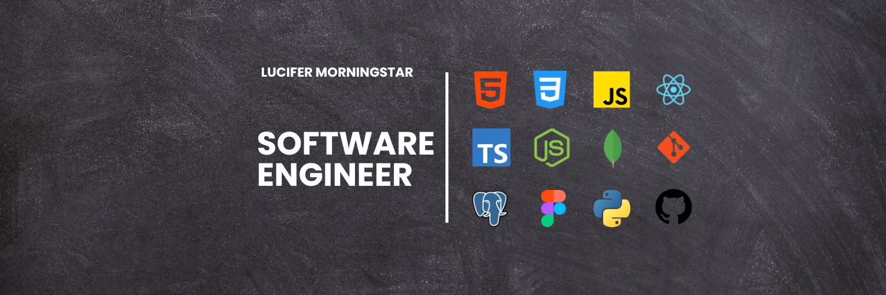

<h1 align="center">

<h3 align="center">I am a full-stack software engineer interested in creating web applications that can impact businesses on a global scale</h3>

  

<h3 align="center">Languages and Tools:</h3>

            

  

&nbsp;

<table bordercolor="#ff69b4">
  <tr>
    <td width="50%" valign="top">
      <h3 align="center">LuxEstate Marketplace</h3>
         
        
         
        

          
    
  
      

        
<strong>React.js | Tailwind CSS | JavaScript | Node.js | MongoDB</strong> - List and manage your properties with ease using LuxEstate! User-friendly marketplace to list & find homes and contact owners directly.

    </td>
    <td width="50%" valign="top">
      <h3 align="center">LumenAI</h3>
         
      
         
        

          
  
  
      

        
<strong>React.js | JavaScript | CSS | OpenAI API </strong> - Intuitive AI language model interface platform utilizing the power of OpenAI's text-davinci-003 model.

    </td>
  </tr>
  
   <tr>
    <td width="50%" valign="top">
      <h3 align="center">Star Trek Species Guide</h3>
         
        
         
        

          
    
  
      

        
<strong>HTML | CSS | JavaScript | RestAPI</strong> - Embark on an exhilarating journey through Star Trek's vibrant extraterrestrial life with this Alien Species Guide!

    </td>
    <td width="50%" valign="top">
      <h3 align="center">Sterling Lane</h3>
         
      
         
        

          
  
  
      

        
<strong>HTML | CSS | JavaScript | Calendly API </strong> - Luxury Real Estate landing page with dynamic scrolling, seamless transitions, captivating photos, and Calendly booking.

    </td>
  </tr>
</table>
