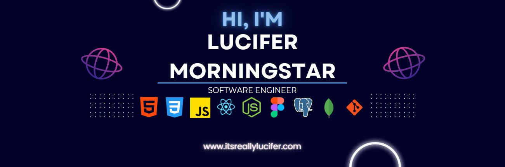

<h1 align="center">

<h3 align="center">I am a full-stack software engineer interested in creating web applications that can impact businesses on a global scale</h3>

  

<h3 align="center">Connect with me:</h3>

<h3 align="center">Languages and Tools:</h3>

            

  

&nbsp;

<table bordercolor="#ff69b4">
  <tr>
    <td width="50%" valign="top">
      <h3 align="center">Star Trek Species Guide</h3>
         
        
         
        

          
    
  
      

        
<strong>HTML | CSS | JavaScript | RestAPI</strong> - Embark on an exhilarating journey through Star Trek's vibrant extraterrestrial life with this Alien Species Guide!

    </td>
    <td width="50%" valign="top">
      <h3 align="center">Sterling Lane</h3>
         
      
         
        

          
  
  
      

        
<strong>HTML | CSS | JavaScript | Calendly API </strong> - Luxury Real Estate landing page with dynamic scrolling, seamless transitions, captivating photos, and Calendly booking.

    </td>
  </tr>
  
   <tr>
    <td width="50%" valign="top">
      <h3 align="center">Space Exploration for kids</h3>
       
        
       
        

  
  
      

        
<strong>HTML | CSS | JavaScript | NASA RestAPI</strong> - Discover an engaging and educational space exploration site for kids with a search-by-date NASA API gallery.

    </td>
    <td width="50%" valign="top">
      <h3 align="center">ItsReallyLucifer.com</h3>
         
        
         
        

          
  
  
      

        
<strong>HTML, CSS, & Javascript</strong> - Portfolio Site which includes links to my projects, socials, and ways to get in contact with me.

    </td>
  </tr>
</table>
